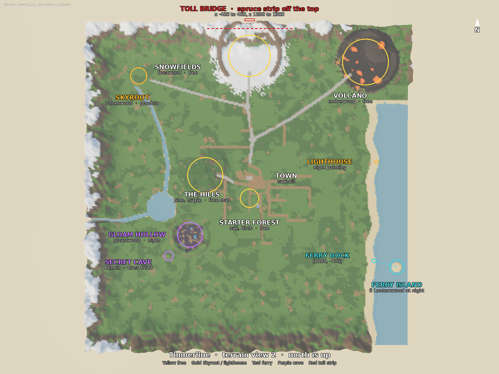

# World design

The region map and unlock path for W2–W4. No code in this batch.

It is built on what is already in the world: `BiomeData` (centres, radii, woods, haul distances), `WorldLayout` and `WorldPlan` (roads, river, coast, island, Skyroot, rims), `RegionLogic` (named regions and the Petrified Reach), `EnvironmentData` (region air from phase 12), `SoundData` (ambient loops), and the phase 12 region and road notes in `V2_PLAN.md`. North is +Z, east is +X. The square world runs from −1500 to 1500 (`WorldLayout.WorldHalf`). W2 adds one north strip beyond that edge (§13). It does not raise `WorldHalf` on every side.

Do not move the town, the sawmill at (0, 110), the sell zone, the spawn, Murph's camp, or any biome centre or radius.

Approved names: **Lanternwood**, **Old Tolly**, **Cap'n Moss**, **the Hermit**, **Hermit's Maul**, **Northern Spruce** (wood id `spruce`).

PR #36 removes vitality, Heartseeds, and planting. This doc does not use a grove meter. The Skyroot Bloom is retired. Cleaning it out of the live game goes to B12.

## 1. The toll gates a new area only

The toll bridge gates one new area, the north strip past the Snowfields. The Snowfields and the Volcano stay free, on `SnowRoad` and `VolcanoRoad`. Old Tolly charges `GameConfig.TollFee` ($100) for `GameConfig.TollSeconds` (180 seconds, 3 minutes). The paid window is `tollPaidUntil`, a server table on `GateService` keyed by UserId. It is not a save field, it is cleared when the player leaves, and the client never sends it.

The payment is for the crossing, in cash, through `EconomyService`. A driver pays for the vehicle: a live `tollPaidUntil` on the driver covers every occupied seat while that vehicle crosses. A player on foot pays for themselves. A second tap inside a live window does not charge again. Short on cash: refuse, do not charge, toast the price (§15).

The booth and the red-and-white arm are visual. The arm does not push anyone. Enforcement is a server check at 2 Hz (every 0.5 s). The check looks for a character, or a seat in a vehicle, that crosses the south edge of the span (z = 1574) heading north. Without a live `tollPaidUntil[userId]`, or without a live window on the driver of that seat, the server moves them to the south end (0, 1566) and toasts Old Tolly and the $100 fee. A player already on the deck or already north of the span stays there when a window expires. Only that northbound crossing is blocked. Southbound passage is free.

The span is a real bridge over a gorge cut across the north spur (§12). The south gap in the snow cliff ring (`WorldLayout.Rims`, snow `gap = -π/2`) stays the free pass into the Snowfields. The spur leaves the north side of that ring and does not touch `SnowRoad` or `VolcanoRoad`.

The timber footbridge on the west river (`WorldPlan`, sign "TIMBER BRIDGE") stays a free foot crossing. It is not this toll.

`V2_PLAN.md` §11 had put this toll in front of the Snowfields and the Volcano, and had the raised arm push players off. Both of those are retired. The prices in `GameConfig` stay.

## 2. Unlock path

Prices below are the keys already in `GameConfig`, except the gondola fee, which is `BiomeData.sky.gondola`.

| Step | Region | Wood | How you get in | Where it sits |
|---|---|---|---|---|
| 0 | Town + Starter Forest | oak, birch | free | town flat zone; starter disc (0, −110), radius 90 |
| 1 | The Hills | pine, maple | free road (`HillsRoad`, 28 wide) | (−420, 110), radius 170. Haul 400 |
| 2 | Snowfields | frostwood | free (`SnowRoad`, 28 wide) | (0, 1240), radius 200. Haul 1200 |
| 2 | The Volcano | emberwood | free (`VolcanoRoad`, 28 wide) | (1100, 1180), radius 220. Haul 1600 |
| 2 | North strip | Northern Spruce (`spruce`) | toll bridge, Old Tolly, $100 for 3 minutes | x −400 to 400, z 1500 to 1900. Bridge centre (0, 1580) |
| 3 | Gloam Hollow, back way, and the Secret Cave | gloamwood (`phantomwood`) | blasting charge on the cracked boulders | hollow (−565, −455), radius 120. Cave on the Petrified Reach, about (−765, −655), radius 46 |
| 4 | Ferry Island | palmwood, and 6 Lanternwood at night | ferry, Cap'n Moss, $400 per rider, every 6 minutes. No trucks | island (1395, −760), radius 70. Dock on the Strand at (1180, −700) |
| 5 | Skyroot and the Aether Isles | lumenwood, and the forge | gondola, already in the world ($250, 40 s) | foot (−1050, 1050). Isles at y 650, radius 170 |

The blasting charge is `GameConfig.DynamitePrice` (220). `BlastingChargePrice` is an alias of that key. A broken boulder may return after `GameConfig.BoulderRespawnSec` (1200 seconds), and only when its box is clear (§11). The ferry fare is `GameConfig.FerryFare` (400) per rider. The boat leaves every `GameConfig.FerryIntervalSec` (360 seconds).

`GateService`, `FerryService`, `BlastService`, and `HazardService` are the wave 0 stubs. Later batches fill those bodies. They do not add a second connection on `TollPay` or `FerryBoard`.

## 3. Sketch

Top-down terrain from `tools/preview`, scene `terrain`, view 2. The camera is (0, 3800, 1) looking at the origin, field of view 50. It sits one stud north of the origin, so the raw frame has north at the bottom. This sketch is that frame flipped. North is up, east is to the right. The heightfield is the live ±1500 map. The north strip, the gorge, and the dock move are drawn on, because view 2 does not contain them yet.



Yellow rings are free ground that already has a centre in `BiomeData`. The red dash north of the snow is the spruce strip (x −400 to 400, z 1500 to 1900), off the current map. Purple is the Secret Cave on the hollow's far side. Teal is the ferry: the Strand dock at about (1180, −700) and Ferry Island. Gold is the Skyroot's foot. The lighthouse at (1203, 236) is marked on its own. It is not the dock.

## 4. Regions

Every region lists its wood, the way in, the landmarks, and why you come back. Fog colours are the phase 12 air in `EnvironmentData.BiomeOverrides` unless a row names a new one. Ambient keys are `SoundData` names that already exist. This doc does not invent asset ids.

Shared reasons, once the matching batch lands: trees regrow in random spots (the regrow branch), the Wood Demand board (§9), daily goals that point at the area (B13), an area badge (B06), and Halloween trees from 1 October through 1 November. Badge ids stay 0 until Connor creates the badges. Award code skips id 0 and does not error. `badgesAwarded`, `secretsFound`, and `areasVisited` are account-wide maps (`{ [string]: boolean }` on the profile, not on a save slot). `storage`, `plot.squares`, `permissions`, and `questAxe` stay on the slot. `secretsFound` and per-slot `questAxe` already exist in `ProfileSchema` at `2d66267`. No schema bump for the keys in §7.

### Town and the Starter Forest

- **Wood.** Oak and birch. `BiomeData` plants 40 oak and 15 birch. Town is the hub, not a grove.
- **Way in.** Free. Spawn is in town. `ForestPath` (16 wide) runs south into the starter disc. Haul 190.
- **Landmarks.** The sawmill at (0, 110), the sell pad and the Sky Bin, the Tool Shed, Dealership, and Hearth & Home, the gondola station, Murph's camp by the spawn, the parking lot, and the signposts (`BuildingArt.nameSign`), including "TO THE WOODS" and "SELL LOGS HERE". The Skyroot is on the northern horizon. The Wood Demand board stands in town, where a seller can read today's two woods.
- **Come back for.** Selling, the demand board, the shops, the limited shelf (B01), regrowth, Halloween trees, dailies, and the town badge.
- **Air and sound.** Starter air is the warm green nudge. Night mist is the grey-blue that thickens from 22:00 and lifts by 09:30. `BirdsDay` by day. `CricketsNight` and `Owl` at night.

### The Hills

- **Wood.** Pine and maple. 40 pine and 25 maple.
- **Way in.** Free. `HillsRoad`, 28 wide, haul 400.
- **Landmarks.** The gate sign. The Old Ranger Cabin north of the Hills' centre (a `RegionLogic` anchor). Mirrorwater, the river and Mirror Lake, on the west side.
- **Come back for.** Pine and maple, including a day the demand board names one of them. Regrowth, Halloween trees, dailies, and the Hills badge. The cabin board points at the hollow. It is not a toll.
- **Air and sound.** A small saturation and contrast nudge. `BirdsDay` in the stands. `River` along Mirrorwater.

### Snowfields

- **Wood.** Frostwood. 35 trees. The climb still carries pine (`RegionLogic` species `snowpine` and `conifer`).
- **Way in.** Free. `SnowRoad`, 28 wide, flares at (30, 450) and (−20, 760). Haul 1200. A brown cliff ring has one pass, and that pass is this road. Nothing on this road charges a toll.
- **Landmarks.** The gate sign. The cliff ring. `SkyrootRoad` leaving west at the second flare. `VolcanoRoad` leaving east at the first flare. The smoking volcano rim to the north-east. The toll bridge is on the far side of the ring, on the new spur, where it cannot close the south pass.
- **Come back for.** Frostwood, a far-region wood the demand board may name. Regrowth, Halloween trees, dailies, and the snow badge. Cold slows chop and move by 15% until the Insulated Coat (`BiomeData` slowdown 0.15, `removedBy = "InsulatedCoat"`).
- **Air and sound.** A cold white-blue haze. `WindHowl`.

### The Volcano

- **Wood.** Emberwood. 30 trees.
- **Way in.** Free. `VolcanoRoad` branches off `SnowRoad` at (30, 450), 28 wide. Haul 1600. A dark rim has one gap, and that gap is this road.
- **Landmarks.** The smoking cone (`WorldLayout.VolcanoCone`). The rim. The gate sign. Cinder Cave, on the volcano shelf, is an existing point of interest. It is not the Hermit's Secret Cave.
- **Come back for.** Emberwood, a far-region wood the demand board may name. Regrowth, Halloween trees, dailies, and the volcano badge. Heat Boots stop the lava burn. Ash storms are weather, not a gate.
- **Air and sound.** Thick red-orange air at every hour, density 0.55. `LavaRumble`.

### North strip (Northern Spruce)

- **Wood.** Northern Spruce, id `spruce`. Price per u³ sits strictly between emberwood ($5.7) and frostwood ($9). Hardness sits from 20 to 50 inclusive. The batch that owns `WoodData` picks the exact price and hardness inside those bands, and inside B02's bands. Spruce stays out of the headline economy path (§11). It is not frostwood and it is not emberwood. Those two stay on the free roads.
- **Way in.** The toll bridge only. See §1 and §12.
- **Landmarks.** The booth, the visual arm, and a `BuildingArt.nameSign` at the south end. The Skyroot and the volcano rim stay visible, so the strip is a place you can steer out of. Southbound does not need a fresh payment.
- **Come back for.** Spruce, including a day the demand board names it as the far-region wood. Regrowth, Halloween trees, dailies, and a strip badge. The 3 minute window is how long one payment covers your northbound crossings. It is not a reason the Snowfields close.
- **Air and sound.** Dark blue-green fog, new in `EnvironmentData`, used only on this strip. Ambience is the existing `WindHowl` loop. No new asset id.

### Gloam Hollow and the Secret Cave

- **Wood.** Gloamwood, id `phantomwood`. 15 trees in the hollow, night only. The Petrified Reach is the same wood (`RegionLogic` id `reach`). Gloamwood is a rare wood. The demand board never names it.
- **Way in.** No haul road. The front gap in the ridge faces town (`WorldLayout.GroveRidge`). The back way is the far side of that ridge, at the reach (about (−765, −655), radius 46). Three cracked boulders seal the mouth and the trail (§16). A blasting charge opens one (`DynamitePrice` 220, 5 second fuse, `BlastPressure` 0, tag `Breakable`). The hollow and the cave need the Lantern (`requiresGear = "Lantern"`).
- **Landmarks.** The Hermit's carved symbol on the cave cliff. The three shallow pools in the hollow. A signpost at the ridge gap.
- **Come back for.** Gloamwood, which is not there by day. The secret cave box. The Hermit's quest, which ends here. The axe is the Hermit's Maul, stored on the slot as `questAxe` (already in `ProfileSchema`). The grove carved mark is on this cliff. Regrowth, Halloween trees, dailies, and the hollow badge.
- **Air and sound.** Violet mist at any hour, density 0.53. `CricketsNight` and `Owl`.
- **Where the Hermit lives.** On this cave. `V2_PLAN.md` §11 had a snow trapdoor under a carved symbol. The symbol is on this cliff. The quest still draws its pieces from the Tool Shed, Hearth & Home, and Odds & Ends. This doc does not reprice that list.

### Ferry Island

- **Wood.** Palmwood, and Lanternwood. Palmwood is already a `WoodData` id whose biome is `island`. The island biome has no `area` yet. Use the existing disc, `WorldLayout.Island` at (1395, −760), radius 70, height 9. Lanternwood is a new id. The wood batch adds the row. `GameConfig.NightGlowWoodId` stays the wave 0 placeholder `lumenwood`. Do not collapse the two ids. Lanternwood is rare. The demand board never names it.
- **Count.** `LanternwoodNightCount = 6`. Six Lanternwood trees stand on the island at night. None stand by day. The count does not move with any meter.
- **Way in.** The ferry. No trucks. Riders and their cargo are welded to the deck for the crossing. Cap'n Moss charges `FerryFare` ($400) per rider, and only riders aboard at departure. The boat leaves every 6 minutes. The dock is on the Strand shore at about (1180, −700), across from the island, about 145 studs of water between the shore and the island's near edge. The lighthouse at (1203, 236) stays where it is. It is not this dock. Deep sea past the coast deals `WaterDamage` 15 every `WaterTickSec` 1.5 seconds.
- **Landmarks.** The dock and Cap'n Moss at (1180, −700). The island's silhouette. A signpost at the dock. The lighthouse, up the coast, still in sight of spawn, with the night painting on its wall.
- **Come back for.** Palmwood. The six Lanternwood trees, only at night. The painting, only at night, at the lighthouse. Regrowth, Halloween trees, dailies, and the island badge.
- **Air and sound.** A warm coastal haze is new in `EnvironmentData` for the Strand and the island. `Splash` is the water hit we already have. No new asset id for a shore loop in this doc.

A player who leaves or resets mid-crossing keeps the cargo that was welded to the deck. That cargo is undamaged.

### Skyroot and the Aether Isles

- **Wood.** Lumenwood, 12 trees, and the forge on the main isle (Starfall Axe, as `V2_PLAN.md` already specifies). Sky Shards are the isle nodes (`SkyShard` 8). Lumenwood is a rare wood. The demand board never names it.
- **Way in.** The gondola, already built. $250 a ride, 40 seconds (`BiomeData.sky.gondola`). Cash only (§15). One station is by the sawmill. The other is at the Skyroot's foot. `SkyrootRoad` (24 wide) stays free. No vehicles on the isles. Logs go down the Cloud Chute into the Sky Bin (`skyBinVolume` 120 u³).
- **Landmarks.** The Skyroot, visible from everywhere. Skyroot Falls. The gondola cables. The forge.
- **Come back for.** Lumenwood, the forge, and Sky Shards. Regrowth, Halloween trees, dailies, and the isle badge. Wind and lightning are the pressure. Wood that falls off the isles is lost. Axes stay. The Featherfall Cloak is the glide down (`GAME_DESIGN` §10).
- **Air and sound.** Thin air above the clouds, density 0.2. The night mist does not apply up here. `WindHowl` on the isles. `WaterfallRoar` at the falls.
- **Skyroot Bloom.** Retired. It is not a reason to visit. B12 removes the leftover.

## 5. Hazards

- **Deep sea** east of the coast and around Ferry Island. `WaterDamage` 15 every `WaterTickSec` 1.5. The Strand beach is the safe side of that line. The boat lane is the ferry's path across it.
- **Volcano heat.** Lava burns until the player has Heat Boots.
- **The dark cave.** The Secret Cave and the hollow need the Lantern.

A slippery frost path on the snow peak stays a frost hazard. It is not a toll and it does not close `SnowRoad`.

## 6. Landmarks you steer by

| Mark | Role |
|---|---|
| The Skyroot | Already standing in the north-west. Visible from everywhere. |
| Toll booth and red-and-white arm | Visual only. On the bridge at (0, 1580). Old Tolly. |
| Lighthouse | Stays at (1203, 236), in sight of spawn. Night painting on its wall. Not the ferry dock. |
| Ferry dock | New, on the Strand at about (1180, −700). Cap'n Moss. |
| Smoking volcano rim | Already on the cone. |
| Hermit's carved symbol | On the Secret Cave cliff. |
| Gate signposts | Already at the gates. `BuildingArt.nameSign`. New gates use the same sign. |
| Wood Demand board | In town. Names today's two woods (§9). |

## 7. Secrets and collectibles

`secretsFound` is the account-wide boolean map already on the profile. The server sets a key from its own `ProximityPrompt` after a distance check. The client does not send the key. Each key is paid once per account. Setting it again is a no-op.

| Key | Where | Position | Trigger radius |
|---|---|---|---|
| `secretsFound["mark_starter"]` | Starter Forest, inside the disc | (24, −150) | 10 |
| `secretsFound["mark_hills"]` | Old Ranger Cabin | (−420, 260) | 10 |
| `secretsFound["mark_snow"]` | Snowfields, beside the south pass, off the road | (40, 1100) | 10 |
| `secretsFound["mark_volcano"]` | Volcano shelf, not Cinder Cave | (1000, 1100) | 10 |
| `secretsFound["mark_grove"]` | Hermit's symbol on the cave cliff | (−780, −670) | 10 |
| `secretsFound["secretCaveBox"]` | Inside the Secret Cave. Our own line | (−770, −680) | 10 |

`CarvedMarkCount = 5`. One mark in each ground biome that exists today: starter, hills, snow, volcano, grove. Ferry Island and the Aether Isles are future homes if a later count grows. They are not part of this five.

When all five `mark_*` keys are set, the server grants `CarvedMarkRewardId = "CarvedTotem"`. The same check runs on load, so a player who already has the five marks and no totem receives it without visiting again. CarvedTotem is decor only. It is never sold, never traded, and it has no stats.

The night-only painting is not a `secretsFound` key. It is drawn on the lighthouse wall at (1203, 236), and only at night.

The firewood bin at a snow cabin (`V2_PLAN.md` §11) can stay snow dressing. It is not the cave box, and it is not behind the toll.

## 8. Why the map keeps paying a return visit

- Trees regrow in random spots (the regrow branch).
- The Wood Demand board names a new pair each in-game day (§9).
- Six Lanternwood trees appear on Ferry Island at night and are gone by day.
- Halloween trees from 1 October through 1 November.
- Daily goals that point at each area (B13).
- Area badges (B06), ids left at 0 until they exist on the Creator dashboard.
- The limited shelf rotation (B01).

`areasVisited` records that a player has reached a region. It is account-wide, same as `secretsFound` and `badgesAwarded`.

## 9. The Wood Demand board

The twist on this map is the board in town, not a grove meter.

Each in-game day (`GameConfig.DayCycleMinutes`) the board names one common wood and one far-region wood. Those two sell for `+ GameConfig.DemandBoost` (0.2, so +20%) until the next day. The boost is applied when the wood is sold. The server owns the day's pair. The client does not pick it.

- **Common pool:** oak, birch, pine, maple.
- **Far-region pool:** frostwood, emberwood, spruce.
- **Never named:** phantomwood, lumenwood, Lanternwood. Those are the rare woods. Palmwood is not in either pool.

Headline economy numbers are measured with the board off. A run of `lune run tools/economy` does not apply `DemandBoost`.

## 10. Constants

W1 does not edit `GameConfig`. A later batch adds these names next to the wave 0 keys. The values are the Designer's, from this review.

```lua
-- Five marks, one in each ground biome that exists today (§7).
-- Ferry Island and the Aether Isles are future homes, not part of this count.
CarvedMarkCount = 5

-- Decor only. Never sold, never traded, no stats.
-- Granted when all five mark_* keys are set, including on load.
CarvedMarkRewardId = "CarvedTotem"

-- Six Lanternwood trees on Ferry Island at night. None by day.
-- Not a function of any grove meter.
LanternwoodNightCount = 6

-- Northern Spruce. Dark blue-green fog. Ambience: SoundData WindHowl.
-- $/u³ strictly between emberwood (5.7) and frostwood (9).
-- Hardness from 20 to 50 inclusive.
-- The WoodData batch picks the exact price and hardness inside those
-- bands and inside B02's bands. Headline model: §11.
TollAreaWoodId = "spruce"
```

## 11. Economy, toll, ferry, boulders

**Headline path.** Northern Spruce and Lanternwood stay out of the headline model, the same way the demand board stays off for those numbers. Adding their rows to `WoodData` must not move B02's full-plot target (28 to 36 h) or the Cobalt band (45 to 75 min). `lune run tools/economy --check` keeps today's headline output. The wood batch wires that exclusion in the model. This doc does not retune a price to chase those bands.

**Toll.** See §1. Check at 2 Hz. Northbound only. Driver's live `tollPaidUntil` covers every seat. On foot, each player needs their own window. Push-back lands on the south end of the span, at (0, 1566), and the toast names Old Tolly and $100.

**Ferry.** No trucks. Riders and cargo weld to the deck. $400 per rider, only those aboard when the boat departs. A player who leaves or resets mid-crossing keeps that welded cargo, undamaged. The weld drops at the island dock or back at (1180, −700) if the crossing ends there.

**Boulders.** Each cracked boulder is one part (§12). After `BoulderRespawnSec`, the server puts the part back only when no character and no vehicle overlaps that part's box. If something overlaps, the server waits 10 seconds and tries again. It does not spawn the part inside a player or a truck.

**Quest axe.** `questAxe` is already per slot in `ProfileSchema`. The Hermit's Maul writes that field. It does not add a profile key and it does not bump the schema.

## 12. Build budget

Spawn is near the 1.7× part cap. W2 places new pieces far from spawn.

| Piece | Cap |
|---|---|
| Everything W2 adds within 640 studs of spawn `(0, 0.5, 40)` | 1,500 parts |
| Secret Cave | one `Model` with `ModelStreamingMode.Atomic`, at most 400 parts |
| Each backdrop | 60 parts |
| Toll booth + arm + bridge, together | 120 parts |
| Ferry dock | 80 parts |
| Ferry boat | 80 parts |
| Each cracked boulder | 1 part |

The toll span is a bridge over a gorge cut across the north spur.

- The deck is 28 studs wide (the haul-road width, along X) and 12 studs deep (along Z).
- Centre (0, 1580). The 2 Hz check's box is x −14 to 14, z 1574 to 1586, tall enough to include a standing character and a truck seat.
- The gorge walls are unclimbable. The bridge is the only crossing, so the box is the only northbound way onto the strip.
- South push-back point: (0, 1566), on the free side of the gorge.

The ferry dock at (1180, −700) and the island's near shore are about 145 studs of water apart. The boat lane is the straight run between them. Trucks are not on that lane.

## 13. Map growth

Add a north strip only: x −400 to 400, z 1500 to 1900. That is 800 by 400 studs, about 4% more area than the 3,000-stud square. Do not raise `WorldLayout.WorldHalf` on all sides. The square stays ±1500. The strip is an extra rect north of z = 1500.

The bridge at z 1580 sits on this strip. Spruce grows north of the gorge, inside the rect, and nowhere else.

If the strip needs code, W2 updates these together, in one change, with a spec that the rect exists and that `WorldHalf` is still 1500:

- `WorldLayout`
- `WorldPlan`
- `TerrainGen`
- `MapBuilder`
- `TerrainBuilder`
- `WeatherService`
- `EnvironmentData` (the dark blue-green fog on the strip)
- `AmbientLife` (`WindHowl` on the strip)

A module on that list that never reads the map edge does not need an edit. Any module that does must land in the same W2 change as the spec. W2 does not move a biome centre or radius, the town, the sawmill, the sell zone, the spawn, or Murph's camp.

## 14. Clearance

PR #36's `TreeFill.Ground` rule is where the ground refuses a tree. W2 adds all of these to that rule, and adds a spec that no wild tree and no regrown tree spawns on any of them:

- The toll spur, treated as a haul road, with the 20-stud gap off its edge.
- The gorge, including the walls and the water or floor of the cut.
- Each cracked boulder's part box.
- The Secret Cave mouth.
- The ferry dock.
- The boat lane from (1180, −700) to the island's near shore.

## 15. Paid crossings

The toll, the ferry, and the gondola take in-game cash only. They never take Robux. Only `EconomyService` changes cash.

If the player is short, the server refuses. It does not charge. It toasts the price: $100 for the toll, $400 for a ferry rider, $250 for the gondola.

A double tap inside one paid window charges once. The toll window is `TollSeconds`. The ferry window is that departure. The gondola window is that ride.

The toll push-back toast names Old Tolly and the $100 fee. The short-cash toast is the price alone. They are different toasts.

## 16. Done when

Positions are world XZ. A prompt passes when its `ProximityPrompt` is on the server, its trigger radius is the number in the table, and a character farther than that radius cannot fire it.

### W2 (the ground)

- The north strip exists at x −400 to 400, z 1500 to 1900, and `WorldHalf` is still 1500.
- The gorge and the bridge match §12. The check box is x −14 to 14, z 1574 to 1586. The south end is (0, 1566).
- Part caps in §12 hold. Nothing new within 640 studs of spawn pushes that bubble over 1,500 added parts.
- The Secret Cave is one Atomic model, at most 400 parts, centred on the reach (−765, −655).
- Three boulder parts stand at the coordinates in the table below. Each is one part.
- The ferry dock is at (1180, −700). The boat lane reaches the island. The lighthouse is still at (1203, 236).
- Six Lanternwood sites sit on the island disc. They are empty by day.
- Spruce sites sit only inside the north strip.
- The clearance spec in §14 fails if a wild or regrown tree's spot lands on the spur, the gorge, a boulder box, the cave mouth, the dock, or the boat lane.
- The modules in §13 that had to change landed together with that spec.

### W3 (the secrets and the Hermit)

Each row is a pass/fail line. The key is set once per account, by the server, after the distance check.

| What | Position | Radius | Pass |
|---|---|---|---|
| Mark, starter | (24, −150) | 10 | `secretsFound["mark_starter"]` |
| Mark, hills | (−420, 260) | 10 | `secretsFound["mark_hills"]` |
| Mark, snow | (40, 1100) | 10 | `secretsFound["mark_snow"]` |
| Mark, volcano | (1000, 1100) | 10 | `secretsFound["mark_volcano"]` |
| Mark, grove | (−780, −670) | 10 | `secretsFound["mark_grove"]` |
| Cave box | (−770, −680) | 10 | `secretsFound["secretCaveBox"]` |
| Hermit | (−752, −640) | 12 | quest prompt opens; does not set a secret key |
| Boulder, cave mouth | (−748, −628) | 10 | blast prompt; one part |
| Boulder, back trail | (−690, −560) | 10 | blast prompt; one part |
| Boulder, ridge | (−810, −700) | 10 | blast prompt; one part |

- All five marks set grants CarvedTotem. A profile that loads with the five marks and no totem is granted the totem on load.
- CarvedTotem cannot be sold or traded, and it has no stats.
- The night painting is visible at (1203, 236) only while the clock is in night hours, and hidden by day.
- No schema bump. `secretsFound` and `questAxe` are the fields already at `2d66267`.

### W4 (the crossings and the respawn)

- At 2 Hz, a character or a vehicle seat that crosses z = 1574 heading north, inside x −14 to 14, without a live window, is moved to (0, 1566). The toast names Old Tolly and $100.
- A driver with a live window carries every occupied seat across. A passenger without their own window still crosses.
- A player on foot who crosses that south edge without a live window is moved south. Standing on the deck does not count as a new crossing.
- A player already on the deck or north of z 1586 when their window expires is not moved.
- Southbound entry does not charge and does not move anyone.
- A second toll tap inside `TollSeconds` does not charge again. Short on cash does not charge, and the toast is the price.
- The ferry welds riders and cargo, charges $400 per rider aboard at departure, and refuses trucks. A leave or reset mid-crossing keeps that cargo, undamaged.
- The gondola charges $250 in cash, once per ride.
- A boulder whose box overlaps a character or a vehicle does not respawn. The server waits 10 seconds and tries again.
- None of these charges Robux.

## 17. Provenance

The layout echoes a few well-known lumber-game gates: a paid bridge, a ferry, boulders in front of a cave. The echo stays in this file. `src/` does not use those names, even in comments.

| Our step | Echo, for this doc only |
|---|---|
| Town + Starter Forest | the main biome |
| The Hills | a mountain roadside |
| Toll, $100 for 3 minutes, on the north strip only | a short paid bridge |
| Secret Cave, blasting charge, Hermit | a cave behind boulders |
| Ferry Island, $400 per rider, every 6 minutes | a ferry to a palm island |
| Skyroot and the Aether Isles | our own ending. No echo |
